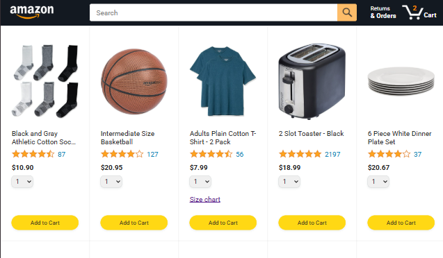
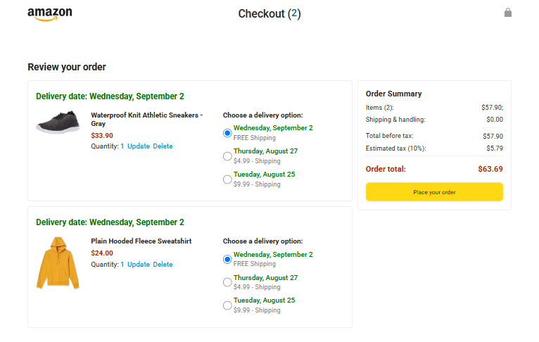
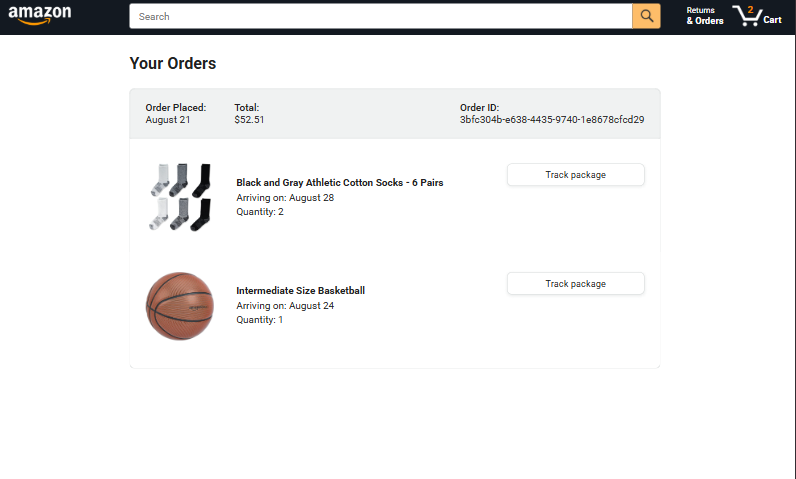
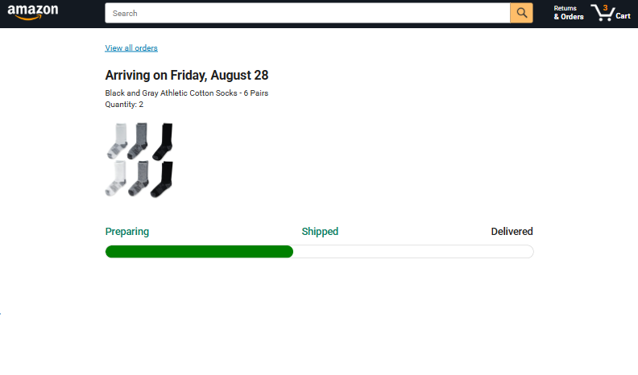

# Amazon Clone

A responsive Amazon-inspired e-commerce website built as a frontend development practice project.

This project recreates the structure and functionality of an online shopping platform, including product browsing, checkout, orders, and package tracking pages.

## 📸 Preview

<!-- Add your project screenshots here -->






## ✨ Features

- Amazon-inspired navigation and layout
- Product browsing interface
- Product listings and shopping interface
- Checkout page
- Orders page
- Package tracking page
- Responsive layouts
- Organized JavaScript files
- Organized CSS styles
- Product and application data
- Backend-related project structure
- Testing structure

## 📄 Pages

### 🛒 Amazon

The main shopping page containing the primary e-commerce interface and product browsing experience.

### 💳 Checkout

A dedicated checkout page for reviewing products and completing the shopping process.

### 📦 Orders

An orders page for displaying previously placed orders.

### 🚚 Tracking

A package tracking page for viewing delivery information.

## 🛠️ Technologies

- HTML5
- CSS3
- JavaScript
- Responsive Web Design

## 📁 Project Structure

```text
Amazon Clone/
│
├── backend/
│   └── Backend-related files
│
├── data/
│   └── Product and application data
│
├── images/
│   └── Website images and assets
│
├── scripts/
│   └── JavaScript files
│
├── styles/
│   └── CSS stylesheets
│
├── tests/
│   └── Project tests
│
├── .gitignore
│
├── amazon.html
├── checkout.html
├── orders.html
├── tracking.html
│
└── README.md
```

## 📱 Responsive Design

The project is designed to work across different screen sizes, including:

- Desktop
- Tablet
- Mobile

Responsive layouts are implemented using CSS techniques and media queries.

## 🎯 Purpose

This project was created to practice frontend web development by recreating an Amazon-inspired e-commerce interface from scratch.

The project focuses on developing practical skills in:

- HTML page structure
- CSS styling and layout
- JavaScript functionality
- Responsive web design
- E-commerce interface development
- Organizing frontend assets
- Working with multiple webpages
- Managing project data
- Testing frontend functionality

## 📚 What I Practiced

Through this project, I practiced building a multi-page e-commerce interface and organizing a larger frontend project into separate sections for styles, scripts, images, data, backend-related files, and tests.

The project also helped me understand how different pages of an e-commerce website can work together as a complete user experience.

## 🚀 Getting Started

### 1. Clone the repository

```bash
git clone YOUR_REPOSITORY_URL
```

### 2. Open the project

```bash
cd amazon-clone
```

### 3. Run the project

Open `amazon.html` in your browser.

For development, you can use the Live Server extension in Visual Studio Code.

## 🌐 Live Demo

https://naman-gudhka.github.io/amazon-clone/

## 👨‍💻 Author

**Naman Gudhka**

## ⚠️ Disclaimer

This is an educational practice project inspired by the Amazon website.

It is not affiliated with, endorsed by, or officially connected to Amazon.

Amazon's name, branding, logos, trademarks, product imagery, and other brand-related assets belong to their respective owners.

This project was created solely for educational and frontend development practice.

## ⭐ Acknowledgement

This project was created to practice frontend web development, responsive design, JavaScript functionality, multi-page website structure, and organization of a larger web development project.